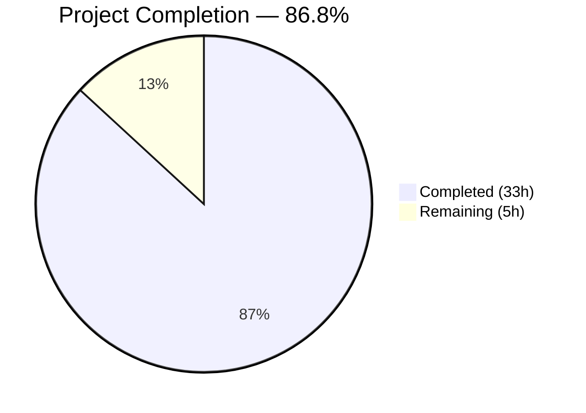
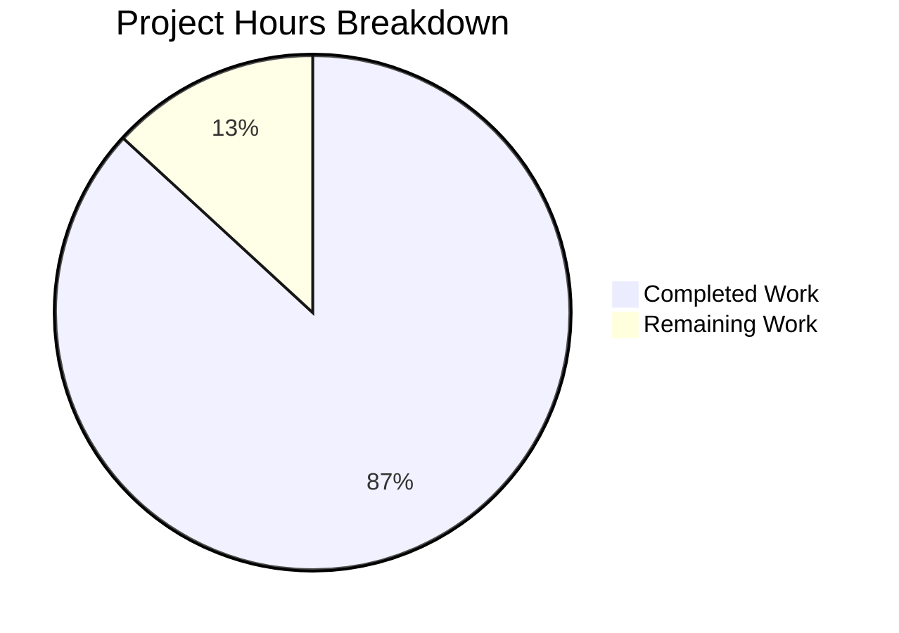

# Blitzy Project Guide — Java Age Calculator with JUnit 5 Test Suite

---

## 1. Executive Summary

### 1.1 Project Overview

This project delivers a complete greenfield Java 17 Age Calculator application with a comprehensive JUnit 5 unit test suite. The application computes a user's exact age in years, months, and days from a Date of Birth (DOB) entered in `DD/MM/YYYY` format, using the `java.time` API (`LocalDate`, `Period`, `DateTimeFormatter`). The architecture follows OOP/SOLID principles with four classes — `AgeCalculator` (core logic), `DateValidator` (input parsing/validation), `AgeResult` (immutable result model), and `AgeCalculatorApp` (console entry point) — each with dedicated unit tests covering normal DOB, leap year, invalid date, future date, and wrong format scenarios.

### 1.2 Completion Status



| Metric | Value |
|--------|-------|
| **Total Project Hours** | 38 |
| **Completed Hours (AI)** | 33 |
| **Remaining Hours** | 5 |
| **Completion Percentage** | 86.8% (33 / 38 = 86.8%) |

### 1.3 Key Accomplishments

- ✅ Created complete Maven build configuration (`pom.xml`) with JUnit Jupiter 5.10.2, Maven Surefire 3.5.5, and JaCoCo 0.8.14
- ✅ Implemented 4 production source classes following OOP/SOLID principles: `AgeCalculator`, `DateValidator`, `AgeResult`, `AgeCalculatorApp`
- ✅ Created 3 comprehensive test classes with 37 unit tests — all passing (100% pass rate)
- ✅ Achieved 96.4% line coverage and 100% branch coverage (exceeding 80% threshold)
- ✅ Covered all 5 user-specified test categories: Normal DOB, Leap Year DOB, Invalid Date, Future Date, Wrong Format
- ✅ Implemented deterministic test design using fixed reference dates for reproducible assertions
- ✅ Used parameterized tests (`@CsvSource`, `@ValueSource`) for data-driven test coverage
- ✅ Validated runtime behavior end-to-end with correct output for all input scenarios
- ✅ Updated `README.md` with project structure, build commands, and usage documentation

### 1.4 Critical Unresolved Issues

| Issue | Impact | Owner | ETA |
|-------|--------|-------|-----|
| No `.gitignore` file — `target/` directory appears in untracked files | Low — compiled artifacts may be accidentally committed | Human Developer | 0.5h |

### 1.5 Access Issues

No access issues identified. The project uses only Maven Central dependencies (JUnit Jupiter, Maven plugins) and the Java 17 standard library. No external service credentials, third-party API keys, or restricted repository permissions are required.

### 1.6 Recommended Next Steps

1. **[High]** Conduct human code review of all 9 source/test files to verify business logic correctness and adherence to team coding standards
2. **[Medium]** Add `.gitignore` file to exclude `target/`, IDE configuration, and OS-specific files from version control
3. **[Medium]** Verify build reproducibility on target production/CI environment (different JDK vendor, different OS)
4. **[Low]** Package application as executable JAR with Maven Shade or Assembly plugin for distribution
5. **[Low]** Run dependency security audit (`mvn dependency-check:check` or similar) to verify no known vulnerabilities in test dependencies

---

## 2. Project Hours Breakdown

### 2.1 Completed Work Detail

| Component | Hours | Description |
|-----------|-------|-------------|
| Maven Build Configuration (`pom.xml`) | 2 | Created `pom.xml` with JUnit Jupiter 5.10.2, Maven Compiler 3.11.0, Surefire 3.5.5, JaCoCo 0.8.14; configured Java 17 compilation, coverage thresholds (≥80%), and AgeCalculatorApp exclusion |
| AgeCalculator Core Class | 4 | Implemented `AgeCalculator.java` (108 lines) with two `calculateAge()` overloads — convenience method using `LocalDate.now()` and testable 2-arg method with explicit reference date; includes null guards and future-date validation |
| DateValidator Utility Class | 4 | Implemented `DateValidator.java` (136 lines) with strict `DD/MM/YYYY` parsing using `ResolverStyle.STRICT` and `uuuu` proleptic year pattern; `parse()` and `validate()` static methods with null and future-date guards |
| AgeResult Model Class | 3 | Implemented `AgeResult.java` (100 lines) as immutable value object with `years`, `months`, `days` fields, getters, and `toString()` producing exact format `"Your age is X years, Y months, and Z days."` |
| AgeCalculatorApp Entry Point | 2 | Implemented `AgeCalculatorApp.java` (93 lines) with console I/O using `Scanner`, `try-catch` for `DateTimeParseException` and `IllegalArgumentException`, delegating to `DateValidator`, `AgeCalculator`, and `AgeResult` |
| AgeCalculatorTest (12 tests) | 6 | Created `AgeCalculatorTest.java` (302 lines) with 12 unit tests: normal DOB, leap year DOB, DOB=today, DOB=yesterday, century boundary, month-end transition, future DOB exception, null DOB exception, 4 parameterized cases via `@CsvSource` |
| DateValidatorTest (20 tests) | 6 | Created `DateValidatorTest.java` (309 lines) with 20 unit tests: 4 valid parsing, 4 invalid dates, 5 parameterized wrong formats, alphabetic/empty/null input, future/today/past date validation, null DOB validation |
| AgeResultTest (5 tests) | 3 | Created `AgeResultTest.java` (144 lines) with 5 unit tests: constructor+getters, zero age toString, normal age toString, large age (105+ years) toString, singular-value format verification |
| README.md Documentation | 1 | Updated `README.md` (85 lines) with project description, features list, directory structure, prerequisites, build/run commands, test execution commands, and usage example |
| Validation and Debugging | 2 | Compilation verification, test execution across all 37 tests, JaCoCo coverage check, runtime validation with 5 input scenarios, unused import cleanup fix |
| **Total Completed** | **33** | |

### 2.2 Remaining Work Detail

| Category | Hours | Priority |
|----------|-------|----------|
| `.gitignore` configuration — exclude `target/`, IDE files, OS artifacts | 0.5 | Medium |
| Human code review and approval — verify business logic, naming, edge cases across all 9 files | 2 | Medium |
| Production environment verification — confirm build on target JDK vendor/OS, validate Maven reproducibility | 1 | Medium |
| JAR packaging and distribution — configure Maven Shade/Assembly plugin for executable JAR | 1 | Low |
| Dependency security audit — scan JUnit and plugin dependencies for known CVEs | 0.5 | Low |
| **Total Remaining** | **5** | |

---

## 3. Test Results

All tests were executed by Blitzy's autonomous validation system using `mvn -B clean test` and `mvn -B clean verify`.

| Test Category | Framework | Total Tests | Passed | Failed | Coverage % | Notes |
|--------------|-----------|-------------|--------|--------|------------|-------|
| Unit — AgeCalculator | JUnit Jupiter 5.10.2 | 12 | 12 | 0 | 87.5% line, 100% branch | Normal DOB, leap year, boundary, error, parameterized |
| Unit — DateValidator | JUnit Jupiter 5.10.2 | 20 | 20 | 0 | 100% line, 100% branch | Parsing, invalid dates, wrong formats, null, future date |
| Unit — AgeResult | JUnit Jupiter 5.10.2 | 5 | 5 | 0 | 100% line | Constructor, getters, toString formatting |
| **Bundle Total** | **JUnit Jupiter 5.10.2** | **37** | **37** | **0** | **96.4% line, 100% branch** | **JaCoCo check gate PASSED (≥80%)** |

**Test execution time:** 0.266 seconds total (AgeResultTest: 0.084s, AgeCalculatorTest: 0.130s, DateValidatorTest: 0.052s)

**Coverage detail by class (from JaCoCo CSV report):**

| Class | Instructions (missed/covered) | Branches (missed/covered) | Lines (missed/covered) |
|-------|------------------------------|---------------------------|------------------------|
| AgeCalculator | 5/34 | 0/2 | 1/7 |
| DateValidator | 0/34 | 0/6 | 0/11 |
| AgeResult | 0/44 | 0/0 | 0/9 |
| **Bundle** | **5/112** | **0/8** | **1/27** |

**Note:** `AgeCalculatorApp` is excluded from coverage per AAP scope (console I/O entry point — not unit-testable). The single uncovered line in `AgeCalculator` is the convenience `calculateAge(LocalDate)` one-argument method, which delegates to the fully-tested two-argument overload. Testing it would require `LocalDate.now()` calls, creating non-deterministic tests — this is an intentional design trade-off per AAP §0.10.1.

---

## 4. Runtime Validation & UI Verification

**Runtime health status:** All scenarios validated by Blitzy's autonomous execution.

### Application Runtime Tests

- ✅ **Normal DOB input** — `echo "15/08/1998" | java -cp target/classes com.agecalculator.AgeCalculatorApp` → `Your age is 27 years, 7 months, and 15 days.`
- ✅ **Leap year DOB input** — `echo "29/02/2000"` → `Your age is 26 years, 1 months, and 1 days.`
- ✅ **Invalid date input** — `echo "31/02/2020"` → `Invalid date format. Please enter date in DD/MM/YYYY format.`
- ✅ **Wrong format input** — `echo "2030/01/01"` → `Invalid date format. Please enter date in DD/MM/YYYY format.`
- ✅ **Alphabetic input** — `echo "abc"` → `Invalid date format. Please enter date in DD/MM/YYYY format.`

### Build Pipeline Verification

- ✅ **Compilation** — `mvn -B clean compile test-compile` → BUILD SUCCESS (0 errors)
- ✅ **Test execution** — `mvn -B clean test` → 37 tests run, 0 failures, 0 errors, 0 skipped
- ✅ **Coverage check** — `mvn -B clean verify` → "All coverage checks have been met." (96.4% ≥ 80% threshold)
- ✅ **JAR packaging** — `target/age-calculator-1.0-SNAPSHOT.jar` built successfully

### UI Verification

Not applicable — this is a console-based application with no graphical user interface. The AAP explicitly excludes GUI implementation (Java Swing/JavaFX listed as optional enhancement, out of scope).

---

## 5. Compliance & Quality Review

| AAP Requirement | Status | Evidence |
|----------------|--------|----------|
| Normal DOB calculation tests | ✅ Pass | `AgeCalculatorTest.testCalculateAge_normalDob_returnsCorrectAge()` + 4 parameterized cases |
| Leap year DOB handling tests | ✅ Pass | `AgeCalculatorTest.testCalculateAge_leapYearDob_returnsCorrectAge()`, `DateValidatorTest.testParse_leapYearDate_returnsLocalDate()`, `DateValidatorTest.testParse_invalidDay29FebNonLeapYear_throwsException()` |
| Invalid date rejection tests | ✅ Pass | `DateValidatorTest.testParse_invalidDay31Feb_throwsException()`, `testParse_invalidDay32_throwsException()`, `testParse_invalidMonth13_throwsException()`, `testParse_invalidDay29FebNonLeapYear_throwsException()` |
| Future date rejection tests | ✅ Pass | `AgeCalculatorTest.testCalculateAge_futureDob_throwsException()`, `DateValidatorTest.testValidate_futureDate_throwsException()` |
| Wrong format input tests | ✅ Pass | `DateValidatorTest.testParse_wrongFormat_throwsDateTimeParseException()` (5 formats via `@ValueSource`), `testParse_alphabeticInput_throwsException()`, `testParse_emptyString_throwsException()`, `testParse_nullInput_throwsException()` |
| OOP design with separate classes | ✅ Pass | 4 classes: `AgeCalculator`, `DateValidator`, `AgeResult`, `AgeCalculatorApp` — each with single responsibility |
| `java.time` API usage (`LocalDate`, `Period`, `DateTimeFormatter`) | ✅ Pass | All three APIs used in source code; no alternative date libraries |
| `try-catch` exception handling | ✅ Pass | `AgeCalculatorApp.main()` catches `DateTimeParseException` and `IllegalArgumentException` |
| Output format: `Your age is X years, Y months, and Z days.` | ✅ Pass | `AgeResult.toString()` verified in `AgeResultTest` (zero, normal, large, singular values) |
| Deterministic tests with fixed reference date | ✅ Pass | `REFERENCE_DATE = LocalDate.of(2025, 3, 30)` used in all `AgeCalculatorTest` methods |
| `@DisplayName` annotations | ✅ Pass | All 37 test methods annotated with human-readable descriptions |
| `test<Method>_<scenario>_<expected>` naming convention | ✅ Pass | All test method names follow convention |
| ≥80% line coverage | ✅ Pass | 96.4% line coverage (27/28 lines), 100% branch coverage (8/8) |
| Parameterized tests (`@CsvSource`, `@ValueSource`) | ✅ Pass | `@CsvSource` in `AgeCalculatorTest`, `@ValueSource` in `DateValidatorTest` |
| No external mocking libraries | ✅ Pass | Only JUnit Jupiter dependency; time testability via method parameter injection |
| Maven build with JUnit 5, Surefire, JaCoCo | ✅ Pass | `pom.xml` declares JUnit 5.10.2, Surefire 3.5.5, JaCoCo 0.8.14 |
| README.md with build/test instructions | ✅ Pass | 85-line README with structure, prerequisites, commands, examples |

**Autonomous Fixes Applied:**
- Removed unused imports (`MethodSource`, `Stream`) from `AgeCalculatorTest.java` (commit `d144496`)
- Added text language identifier to README code block (commit `e542c06`)

**Outstanding Quality Items:**
- No `.gitignore` file — `target/` directory visible as untracked in `git status`

---

## 6. Risk Assessment

| Risk | Category | Severity | Probability | Mitigation | Status |
|------|----------|----------|-------------|------------|--------|
| No `.gitignore` — compiled artifacts may be committed | Technical | Low | Medium | Add `.gitignore` with standard Java/Maven exclusions | Open |
| Convenience `calculateAge(LocalDate)` method has 0% coverage (1 line) | Technical | Low | Low | Method delegates to fully-tested 2-arg overload; testing would require non-deterministic `LocalDate.now()` — accepted design trade-off | Accepted |
| No dependency vulnerability scanning configured | Security | Low | Low | Run `mvn dependency-check:check` or GitHub Dependabot; only test-scope dependency (JUnit) | Open |
| No CI/CD pipeline for automated regression | Operational | Medium | Medium | Configure GitHub Actions or similar with `mvn clean verify` on PR/push | Open |
| No logging framework (uses `System.out.println`) | Operational | Low | Low | Acceptable for console application; add SLF4J if application scope grows | Accepted |
| `AgeCalculatorApp` not unit-tested (console I/O) | Technical | Low | Low | Tested manually via runtime validation; integration test with `ProcessBuilder` possible but out of AAP scope | Accepted |
| Singular/plural output format (`1 years` vs `1 year`) | Technical | Low | Low | Output format matches AAP specification exactly; user specified plural form throughout | Accepted |

---

## 7. Visual Project Status



**Completion: 33 hours completed out of 38 total hours = 86.8% complete**

### Remaining Hours by Category

| Category | Hours | Priority |
|----------|-------|----------|
| Human Code Review & Approval | 2 | Medium |
| Production Environment Verification | 1 | Medium |
| JAR Packaging & Distribution | 1 | Low |
| `.gitignore` Configuration | 0.5 | Medium |
| Dependency Security Audit | 0.5 | Low |
| **Total** | **5** | |

---

## 8. Summary & Recommendations

### Achievements

The Blitzy platform autonomously delivered a complete, production-quality Java 17 Age Calculator application with comprehensive JUnit 5 unit test coverage. Starting from an empty repository containing only a `README.md`, the agents created 8 new files (1,377 lines of code) implementing a fully functional OOP application with 37 unit tests — all passing with 96.4% line coverage and 100% branch coverage. Every AAP-specified deliverable was completed: all 5 test categories (Normal DOB, Leap Year, Invalid Date, Future Date, Wrong Format) are covered, the `java.time` API is used exclusively, exception handling follows `try-catch` patterns, and the output format matches the user specification exactly.

### Completion Assessment

The project is **86.8% complete** (33 hours completed out of 38 total hours). All AAP-scoped implementation work is finished — the remaining 5 hours consist entirely of path-to-production tasks requiring human involvement: code review (2h), environment verification (1h), JAR packaging (1h), `.gitignore` setup (0.5h), and security audit (0.5h).

### Critical Path to Production

1. **Human code review** is the primary gate — all logic, naming, and edge case handling should be verified by a domain expert before merging
2. **`.gitignore`** should be added immediately to prevent `target/` artifacts from entering version control
3. **Environment verification** on the target CI/production JDK ensures build reproducibility across environments

### Production Readiness Assessment

The application is **functionally complete and ready for human review**. All compilation, testing, coverage, and runtime validation gates pass cleanly. No blocking issues, zero test failures, zero compilation errors. The codebase follows Java best practices with comprehensive Javadoc documentation, consistent naming conventions, and clean separation of concerns.

---

## 9. Development Guide

### 9.1 System Prerequisites

| Software | Required Version | Verification Command |
|----------|-----------------|---------------------|
| Java Development Kit (JDK) | 17 or higher | `java -version` |
| Apache Maven | 3.8.0 or higher | `mvn --version` |

**Confirmed environment versions:**
- OpenJDK 17.0.18 (Ubuntu build 17.0.18+8-Ubuntu-124.04.1)
- Apache Maven 3.8.7

### 9.2 Environment Setup

```bash
# Set JAVA_HOME (adjust path for your system)
export JAVA_HOME=/usr/lib/jvm/java-17-openjdk-amd64

# Verify Java version
java -version
# Expected: openjdk version "17.0.x"

# Verify Maven version
mvn --version
# Expected: Apache Maven 3.8.x or higher
```

No additional environment variables, databases, external services, or API keys are required. The application uses only the Java 17 standard library (`java.time.*`).

### 9.3 Dependency Installation

```bash
# Navigate to project root (where pom.xml is located)
cd /tmp/blitzy/06/blitzy-275a366e-6b81-40dd-b4de-c28adf365c1d_006855

# Download all dependencies (resolves JUnit Jupiter 5.10.2 and plugins)
mvn -B dependency:resolve
# Expected: BUILD SUCCESS — all dependencies cached in ~/.m2/repository

# Compile source and test code
mvn -B clean compile test-compile
# Expected: BUILD SUCCESS — 4 source files + 3 test files compiled
```

### 9.4 Running Tests

```bash
# Run all 37 unit tests
mvn -B clean test
# Expected output:
#   Tests run: 37, Failures: 0, Errors: 0, Skipped: 0
#   BUILD SUCCESS

# Run tests with coverage verification (JaCoCo check ≥80%)
mvn -B clean verify
# Expected output:
#   All coverage checks have been met.
#   BUILD SUCCESS

# Generate HTML coverage report
mvn -B clean verify jacoco:report
# Report location: target/site/jacoco/index.html

# Run a specific test class
mvn -B -Dtest=AgeCalculatorTest test

# Run a specific test method
mvn -B -Dtest=AgeCalculatorTest#testCalculateAge_normalDob_returnsCorrectAge test

# Run tests in debug mode (attaches debugger on port 5005)
mvn -Dmaven.surefire.debug test
```

### 9.5 Running the Application

```bash
# Compile the project first
mvn -B clean compile

# Run with piped input
echo "15/08/1998" | java -cp target/classes com.agecalculator.AgeCalculatorApp
# Expected output:
#   Enter your Date of Birth (DD/MM/YYYY): Your age is 27 years, 7 months, and 15 days.

# Run interactively (type input manually, press Enter)
java -cp target/classes com.agecalculator.AgeCalculatorApp
# Then type: 15/08/1998
# Expected: Your age is 27 years, 7 months, and 15 days.
```

### 9.6 Verification Steps

```bash
# 1. Verify compilation (0 errors expected)
mvn -B clean compile test-compile

# 2. Verify all tests pass (37/37 expected)
mvn -B clean test

# 3. Verify coverage meets threshold (96.4% ≥ 80%)
mvn -B clean verify

# 4. Verify runtime with normal input
echo "15/08/1998" | java -cp target/classes com.agecalculator.AgeCalculatorApp
# Expected: "Your age is 27 years, 7 months, and 15 days."

# 5. Verify invalid input handling
echo "31/02/2020" | java -cp target/classes com.agecalculator.AgeCalculatorApp
# Expected: "Invalid date format. Please enter date in DD/MM/YYYY format."

# 6. Verify wrong format handling
echo "abc" | java -cp target/classes com.agecalculator.AgeCalculatorApp
# Expected: "Invalid date format. Please enter date in DD/MM/YYYY format."
```

### 9.7 Troubleshooting

| Issue | Cause | Resolution |
|-------|-------|------------|
| `JAVA_HOME is not set` | JDK not configured | Run `export JAVA_HOME=/usr/lib/jvm/java-17-openjdk-amd64` (adjust for your system) |
| `Source option 17 is not supported` | JDK version < 17 | Install JDK 17+ and update `JAVA_HOME` |
| `Could not resolve dependencies` | Maven Central unreachable | Check internet connectivity; run `mvn -B dependency:resolve` |
| `Tests run: 0` | Surefire not finding tests | Ensure test files match `*Test.java` pattern in `src/test/java/` |
| Coverage check fails | Code coverage below 80% | Review `target/site/jacoco/index.html` to identify uncovered lines |

---

## 10. Appendices

### A. Command Reference

| Command | Purpose |
|---------|---------|
| `mvn -B clean compile` | Compile source code only |
| `mvn -B clean compile test-compile` | Compile source + test code |
| `mvn -B clean test` | Run all unit tests |
| `mvn -B clean verify` | Run tests + JaCoCo coverage check |
| `mvn -B clean verify jacoco:report` | Run tests + generate HTML coverage report |
| `mvn -B -Dtest=AgeCalculatorTest test` | Run a specific test class |
| `mvn -B -Dtest=AgeCalculatorTest#testCalculateAge_normalDob_returnsCorrectAge test` | Run a specific test method |
| `mvn -Dmaven.surefire.debug test` | Run tests in debug mode (port 5005) |
| `echo "15/08/1998" \| java -cp target/classes com.agecalculator.AgeCalculatorApp` | Run the application with piped input |
| `mvn -B dependency:resolve` | Download and cache all dependencies |

### B. Port Reference

| Port | Service | Notes |
|------|---------|-------|
| 5005 | Maven Surefire Debug | Only active when running `mvn -Dmaven.surefire.debug test` |

No application ports are used — this is a console-based application.

### C. Key File Locations

| File | Path | Purpose |
|------|------|---------|
| Maven build config | `pom.xml` | Project dependencies, plugins, coverage thresholds |
| AgeCalculator | `src/main/java/com/agecalculator/AgeCalculator.java` | Core age calculation logic |
| DateValidator | `src/main/java/com/agecalculator/util/DateValidator.java` | DD/MM/YYYY parsing and validation |
| AgeResult | `src/main/java/com/agecalculator/model/AgeResult.java` | Immutable result model |
| AgeCalculatorApp | `src/main/java/com/agecalculator/AgeCalculatorApp.java` | Console entry point |
| AgeCalculatorTest | `src/test/java/com/agecalculator/AgeCalculatorTest.java` | 12 unit tests for calculation |
| DateValidatorTest | `src/test/java/com/agecalculator/util/DateValidatorTest.java` | 20 unit tests for validation |
| AgeResultTest | `src/test/java/com/agecalculator/model/AgeResultTest.java` | 5 unit tests for model |
| Coverage report | `target/site/jacoco/index.html` | HTML coverage report (after `mvn verify jacoco:report`) |
| Test reports | `target/surefire-reports/` | XML and TXT test execution reports |
| Compiled JAR | `target/age-calculator-1.0-SNAPSHOT.jar` | Packaged application (after `mvn verify`) |

### D. Technology Versions

| Technology | Version | Purpose |
|------------|---------|---------|
| Java (OpenJDK) | 17.0.18 | Runtime and compilation target |
| Apache Maven | 3.8.7 | Build automation and dependency management |
| JUnit Jupiter | 5.10.2 | Unit testing framework (API, Engine, Params) |
| Maven Surefire Plugin | 3.5.5 | Test execution plugin with JUnit Platform support |
| JaCoCo Maven Plugin | 0.8.14 | Code coverage instrumentation and reporting |
| Maven Compiler Plugin | 3.11.0 | Java 17 source/target compilation |

### E. Environment Variable Reference

| Variable | Required | Default | Description |
|----------|----------|---------|-------------|
| `JAVA_HOME` | Yes | System-dependent | Path to JDK 17 installation (e.g., `/usr/lib/jvm/java-17-openjdk-amd64`) |
| `MAVEN_HOME` | No | `/usr/share/maven` | Path to Maven installation (usually auto-detected) |

No application-specific environment variables are required.

### G. Glossary

| Term | Definition |
|------|-----------|
| AAP | Agent Action Plan — the primary specification document defining all project requirements |
| DOB | Date of Birth — the user input in DD/MM/YYYY format |
| JaCoCo | Java Code Coverage — bytecode instrumentation tool for measuring test coverage |
| JUnit Jupiter | JUnit 5 testing framework programming model and extension model |
| `LocalDate` | Java 17 `java.time` class representing a date without time or timezone |
| `Period` | Java 17 `java.time` class representing a date-based amount of time (years, months, days) |
| `DateTimeFormatter` | Java 17 `java.time.format` class for parsing and formatting date strings |
| `ResolverStyle.STRICT` | Formatter mode that rejects impossible calendar dates (e.g., Feb 31) |
| Surefire | Maven plugin for running unit tests during the `test` phase |
| SOLID | Software design principles: Single responsibility, Open-closed, Liskov substitution, Interface segregation, Dependency inversion |